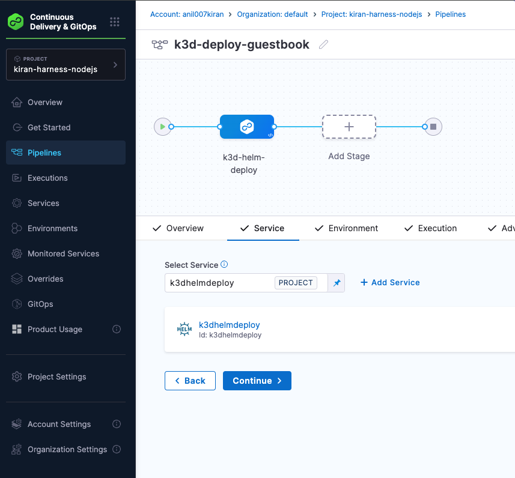

# Deploy an Application to a Kubernetes Cluster Using GitOps, Harness, Helm, and K3D

This guide provides a step-by-step walkthrough on deploying an application to a Kubernetes cluster using GitOps principles, leveraging Harness, Helm, and K3D. Screenshots accompany each step for clarity.

---

## Table of Contents
1. [Install K3D Using Brew](#install-k3d-using-brew)
2. [Create a Local Kubernetes Cluster Using K3D](#create-a-local-kubernetes-cluster-using-k3d)
3. [Switch to the Respective Cluster Using `kubectl config current-context`](#switch-to-the-respective-cluster-using-kubectl-config-current-context)
4. [Get K3D Cluster Nodes](#get-k3d-cluster-nodes)
5. [Install Harness Delegate onto K3D Cluster](#install-harness-delegate-onto-k3d-cluster)
6. [Create a GitHub Secret](#create-a-github-secret)
7. [Configure Harness GitHub Connector](#configure-harness-github-connector)
8. [Configure Harness K8s Cluster Connector](#configure-harness-k8s-cluster-connector)
9. [Configure Harness K3D Local Environment](#configure-harness-k3d-local-environment)
10. [Configure Harness K3D Infra Definition](#configure-harness-k3d-infra-definition)
11. [Configure Harness Service](#configure-harness-service)
12. [Create Harness K8s Pipeline](#create-harness-k8s-pipeline)
13. [Add a Pipeline Stage](#add-a-pipeline-stage)
14. [Add a Pipeline Service](#add-a-pipeline-service)
15. [Add a Pipeline Environment](#add-a-pipeline-environment)
16. [Get Pods Running in Namespace](#get-pods-running-in-namespace)
17. [Port Forward the Application Service for Testing](#port-forward-the-application-service-for-testing)
18. [Access the App from Browser](#access-the-app-from-browser)

---

### 1. Install K3D Using Brew
Install K3D, a lightweight Kubernetes distribution, using Homebrew. Run the following command:

```bash
brew install k3d
```


This ensures you have the necessary tools to create a Kubernetes cluster locally.

### 2. Create a Local Kubernetes Cluster Using K3D
Create a local Kubernetes cluster with K3D using:

```bash
k3d cluster create kiran-local-cluster
```


This command sets up a new cluster named `kiran-local-cluster`.

### 3. Switch to the Respective Cluster Using `kubectl config current-context`
Ensure you are using the correct context by running:

```bash
kubectl config current-context
```


Verify the output matches the desired cluster.

### 4. Get K3D Cluster Nodes
List the nodes in your K3D cluster:

```bash
kubectl get nodes
```


This confirms the nodes are ready and operational.

### 5. Install Harness Delegate onto K3D Cluster
Deploy the Harness delegate to the cluster to facilitate communication with the Harness platform:

```bash
kubectl apply -f harness-delegate.yaml
```


Ensure the delegate is up and running.

### 6. Create a GitHub Secret
Generate a GitHub personal access token and create a Kubernetes secret:

```bash
kubectl create secret generic github-secret --from-literal=token=<YOUR_TOKEN>
```


This will securely store your GitHub credentials in the cluster.

### 7. Configure Harness GitHub Connector
Set up a GitHub connector in the Harness platform to integrate your GitOps repository. This allows Harness to fetch Helm charts and manifests.


### 8. Configure Harness K8s Cluster Connector
Connect the K3D cluster to Harness using the K8s connector. Provide the cluster details, including the API server URL and authentication method.


### 9. Configure Harness K3D Local Environment
Define a Harness environment to represent the local K3D setup. Assign appropriate service and infrastructure definitions.


### 10. Configure Harness K3D Infra Definition
Set up an infrastructure definition in Harness to map to the K3D cluster. This includes namespace and cluster configuration details.


### 11. Configure Harness Service
Create a Harness service for the application you wish to deploy. Specify deployment templates and artifacts.


### 12. Create Harness K8s Pipeline
Build a Kubernetes deployment pipeline in Harness. Add stages to automate the GitOps workflow.


### 13. Add a Pipeline Stage
Add a deployment stage to the pipeline. Define the steps for deploying your application to the K3D cluster.


### 14. Add a Pipeline Service
Integrate the previously created service into the pipeline stage. This binds the pipeline to your application's configurations.



### 15. Add a Pipeline Environment
Attach the local K3D environment to the pipeline. This ensures deployments occur in the desired cluster.


### 16. Get Pods Running in Namespace
Verify the application pods are running:

```bash
kubectl get pods -n <namespace>
```


Check the status to ensure all pods are healthy.

### 17. Port Forward the Application Service for Testing
Expose the application service locally for testing:

```bash
kubectl port-forward svc/<service-name> 8080:80 -n <namespace>
```


### 18. Access the App from Browser
Open your browser and navigate to:

```plaintext
http://localhost:8080
```


You should see your application up and running.

---

This end-to-end guide demonstrates deploying applications to a Kubernetes cluster using modern GitOps tools and practices. Feel free to explore and adapt it to your needs!# Deploy an Application to a Kubernetes Cluster Using GitOps, Harness, Helm, and K3D.

This end-to-end guide demonstrates deploying applications to a Kubernetes cluster using modern GitOps tools and practices. Feel free to explore and adapt it to your needs!